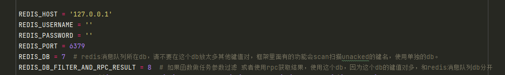

# 1 nb_proxypool

nb_proxypool 代理池power by funboost

## 2 运行方式

### 2.0 安装依赖

使用了boost_sipder里面的请求类

pip install boost_spider

boost_spider会自动安装funboost.

### 2.1 配置redis账号
拉取代码,修改funboost_config.py的redis的账号密码

### 2.2 运行代理自动抓取和超高速并发检测生成redis代理池

点击运行 nb_proxypool/run_get_and_check_proxy.py

## 3 nb_proxypool 代码写法说明

nb_proxypool采用的是funboost框架驱动函数并发和定时,如果想弄清楚用法,用户需要阅读分布式函数万能框架funboost文档

[https://funboost.readthedocs.io/zh/latest/](https://funboost.readthedocs.io/zh/latest/)
