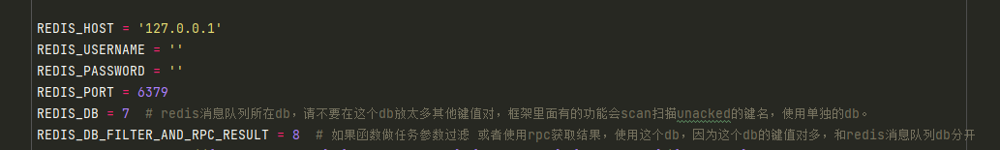

# 1 nb_proxypool

nb_proxypool 代理池power by funboost

## 2 运行方式

### 2.0 安装依赖

使用了boost_sipder里面的请求类

pip install boost_spider

boost_spider会自动安装funboost.

### 2.1 配置redis账号

拉取代码,修改funboost_config.py配置文件的redis的账号密码



### 2.2 运行代理自动抓取和超高速并发检测生成redis代理池

点击运行 run_proxy.py

## 3 nb_proxypool 代码写法说明

nb_proxypool采用的是funboost框架驱动函数并发和定时,如果想弄清楚用法,用户需要阅读分布式函数万能框架funboost文档

[https://funboost.readthedocs.io/zh/latest/](https://funboost.readthedocs.io/zh/latest/)

## 4使用redis中的代理ip方式

直接使用 proxy_request_client.py 中的 ProxyClient 发请求就好了,该类的方法名和入参和requests 100%一致,兼容性极好.

下面代码表示 按照 不使用代理和使用free代理池的请求顺序来请求百度,最大重试轮流请求4次

```
ProxyClient(proxy_name_list=[
        ProxyClient.PROXY_FREE, ProxyClient.PROXY_NOPROXY],request_retry_times=4).get('https://www.baidu.com')

```

用户也可以自己使用requests从redis中获取代理,不使用ProxyClient类.